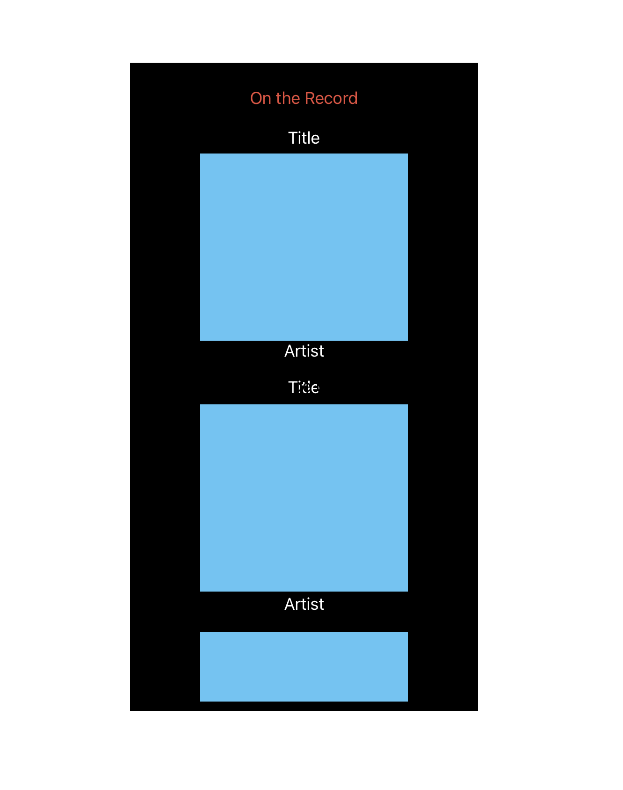

# On the Record - Project 4 Frontend
- Project By: Nicholas Smith
- [Github](https://github.com/nicholasjamessmith/ontherecord-frontend)
- [Backend Readme](https://github.com/nicholasjamessmith/ontherecord-backend/blob/main/README.md)
- [Deployed Site](https://ontherecord-q4ph.onrender.com/)
- [Trello Board](https://trello.com/b/BON8XkBD/project4)
- Technologies used:
  - JavaScript
  - React
  - Render

## Description
On the Record is a music and art review site where users are able to create, read, update, and delete reviews. Users can view a list of reviews on the home page of the site, and interact with each review by clicking on it. Clicking on a review takes users to a page where they can then view that individual reveiew and by clicking choose to update the review's information or delete the review. Updating the review requires the user to fill out text forms and click a submit button, triggering the page to reload with the updated information dispaled. Deleting a review takes the user back to home page to an updated list of reviews.

### Index Page Mockup

### Show Page Mockup

### Mobile View Mockup (Index Page)
